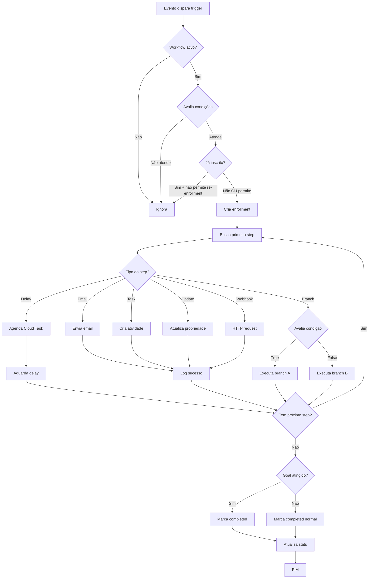

# 🏗️ Arquitetura do CRM - Planejamento Financeiro

## 📋 Índice

1. [Visão Geral](#visão-geral)
2. [Stack Tecnológica](#stack-tecnológica)
3. [Estrutura do Projeto](#estrutura-do-projeto)
4. [Arquitetura de Dados](#arquitetura-de-dados)
5. [Workflow Engine](#workflow-engine)
6. [Fluxo de Dados](#fluxo-de-dados)
7. [Segurança](#segurança)
8. [Performance](#performance)
9. [Roadmap de Desenvolvimento](#roadmap-de-desenvolvimento)

---

## 🎯 Visão Geral

CRM completo para escritório de planejamento financeiro pessoal, com foco em **automação de workflows** tipo HubSpot.

### Objetivos Principais

- ✅ Gestão de 900+ clientes ativos
- ✅ Automação de processos de vendas e relacionamento
- ✅ Pipeline de negócios visual (Kanban)
- ✅ Workflows customizáveis (triggers + ações)
- ✅ Analytics e relatórios de performance

### Decisões Arquiteturais

**Por que React + Vite (não Next.js)?**
- CRM é aplicação autenticada (SSR tem valor limitado)
- Build mais rápido e HMR instantâneo
- Menos complexidade (pure SPA)
- Aproveita 70% do código já desenvolvido

**Por que Firebase?**
- Firestore: NoSQL escalável com queries em tempo real
- Firebase Auth: Sistema de autenticação completo
- Cloud Functions: Backend serverless
- Cloud Tasks: Agendamento de workflows
- Hosting integrado e CDN global

---

## 🛠️ Stack Tecnológica

### Frontend

| Tecnologia | Versão | Propósito |
|------------|--------|-----------|
| **React** | 18.3.1 | Framework UI |
| **Vite** | 5.4.19 | Build tool + dev server |
| **TypeScript** | 5.8.3 | Type safety |
| **TanStack Query** | 5.83.0 | Server state + cache |
| **React Router** | 6.30.1 | Client-side routing |
| **React Hook Form** | 7.61.1 | Form management |
| **Zod** | 3.25.76 | Schema validation |
| **Shadcn/UI** | latest | Component library |
| **Tailwind CSS** | 3.4.17 | Styling |
| **Lucide React** | 0.462.0 | Icons |
| **React Flow** | (a instalar) | Workflow visual builder |
| **Recharts** | 2.15.4 | Data visualization |

### Backend & Database

| Tecnologia | Propósito |
|------------|-----------|
| **Firebase Firestore** | Database NoSQL |
| **Firebase Authentication** | Auth provider |
| **Firebase Storage** | File storage |
| **Firebase Cloud Functions** | Serverless backend |
| **Firebase Cloud Tasks** | Job scheduling |
| **Firebase Hosting** | Static hosting |

### DevOps

| Ferramenta | Propósito |
|------------|-----------|
| **GitHub** | Version control |
| **Vercel** ou **Firebase Hosting** | Deploy |
| **ESLint** | Code linting |
| **Vitest** (a configurar) | Unit tests |

---

## 📁 Estrutura do Projeto

```
/CRM
├── /src
│   ├── /app                        # Routing (App.tsx)
│   ├── /pages                      # Page components (8 existentes)
│   │   ├── Dashboard.tsx
│   │   ├── Contacts.tsx
│   │   ├── Deals.tsx
│   │   ├── Clients.tsx
│   │   ├── Forms.tsx
│   │   ├── Reports.tsx
│   │   ├── Settings.tsx
│   │   └── /workflows              # [NOVO] Gestão de workflows
│   │       ├── WorkflowList.tsx
│   │       ├── WorkflowBuilder.tsx
│   │       └── WorkflowAnalytics.tsx
│   │
│   ├── /components
│   │   ├── /ui                     # Shadcn/UI (50+ componentes)
│   │   ├── Navigation.tsx
│   │   ├── CrmLayout.tsx
│   │   └── /workflows              # [NOVO] Workflow components
│   │       ├── TriggerNode.tsx
│   │       ├── ActionNode.tsx
│   │       ├── DelayNode.tsx
│   │       ├── BranchNode.tsx
│   │       └── WorkflowCanvas.tsx
│   │
│   ├── /lib
│   │   ├── utils.ts
│   │   ├── /firebase               # [NOVO] Firebase setup
│   │   │   ├── config.ts           # Firebase config
│   │   │   ├── firestore.ts        # Firestore helpers
│   │   │   ├── auth.ts             # Auth helpers
│   │   │   └── storage.ts          # Storage helpers
│   │   │
│   │   ├── /services               # [NOVO] Business logic
│   │   │   ├── contactService.ts
│   │   │   ├── dealService.ts
│   │   │   ├── workflowService.ts
│   │   │   ├── activityService.ts
│   │   │   ├── emailService.ts
│   │   │   └── automationEngine.ts # Core workflow engine
│   │   │
│   │   ├── /types                  # [NOVO] TypeScript types
│   │   │   ├── contact.types.ts
│   │   │   ├── deal.types.ts
│   │   │   ├── workflow.types.ts
│   │   │   ├── activity.types.ts
│   │   │   └── user.types.ts
│   │   │
│   │   ├── /validators             # [NOVO] Zod schemas
│   │   │   ├── contact.schema.ts
│   │   │   ├── deal.schema.ts
│   │   │   └── workflow.schema.ts
│   │   │
│   │   └── /hooks                  # [NOVO] Custom React hooks
│   │       ├── useContacts.ts      # TanStack Query hooks
│   │       ├── useDeals.ts
│   │       ├── useWorkflows.ts
│   │       └── useAuth.ts
│   │
│   ├── /contexts                   # [NOVO] React contexts
│   │   ├── AuthContext.tsx
│   │   └── WorkflowContext.tsx
│   │
│   └── /hooks
│       ├── use-toast.ts
│       └── use-mobile.tsx
│
├── /functions                       # [NOVO] Firebase Functions
│   ├── /src
│   │   ├── index.ts
│   │   ├── /automation
│   │   │   ├── workflowEngine.ts   # Engine principal
│   │   │   ├── triggers.ts         # Firestore triggers
│   │   │   ├── scheduler.ts        # Cloud Tasks scheduler
│   │   │   └── executors.ts        # Step executors
│   │   │
│   │   ├── /api
│   │   │   ├── webhooks.ts         # Webhooks externos
│   │   │   └── email.ts            # Email sending
│   │   │
│   │   └── /utils
│   │       ├── logger.ts
│   │       └── validators.ts
│   │
│   ├── package.json
│   └── tsconfig.json
│
├── /firestore.rules                 # [NOVO] Security rules
├── /firestore.indexes.json          # [NOVO] Composite indexes
├── /storage.rules                   # [NOVO] Storage rules
├── firebase.json                    # [NOVO] Firebase config
│
├── .env.example                     # [NOVO] Environment variables
├── ARCHITECTURE.md                  # Este arquivo
├── WORKFLOWS.md                     # [NOVO] Workflow engine docs
├── API.md                           # [NOVO] API documentation
└── README.md                        # [ATUALIZAR] Setup guide
```

---

## 🗄️ Arquitetura de Dados

### Firestore Collections

#### 1. `users`

```typescript
{
  id: string                          // UID do Firebase Auth
  email: string
  name: string
  role: 'admin' | 'planner' | 'viewer'
  permissions: string[]
  avatar?: string
  createdAt: Timestamp
  updatedAt: Timestamp
  preferences: {
    theme: 'light' | 'dark'
    notifications: boolean
    timezone: string
  }
}
```

**Indexes:**
- `email` (unique)
- `role` + `createdAt`

---

#### 2. `contacts`

```typescript
{
  id: string

  // Dados básicos
  firstName: string
  lastName: string
  email: string
  phone: string
  cpf?: string

  // Profissionais
  occupation?: string
  company?: string
  income?: number

  // Endereço
  address?: {
    street: string
    city: string
    state: string
    zipCode: string
  }

  // CRM Status
  status: 'lead' | 'prospect' | 'client' | 'inactive' | 'lost'
  leadScore: number                   // 0-100
  lifecycle_stage: 'subscriber' | 'lead' | 'mql' | 'sql' | 'opportunity' | 'customer'

  // Relacionamento
  ownerId: string                     // Planejador responsável
  source: 'organic' | 'meta_ads' | 'google_ads' | 'referral' | 'manual'

  // Tags e segmentação
  tags: string[]
  lists: string[]

  // Tracking
  lastContactedAt?: Timestamp
  lastActivityAt?: Timestamp
  createdAt: Timestamp
  updatedAt: Timestamp

  // Workflows
  enrolledWorkflows: string[]
  workflowHistory: Array<{
    workflowId: string
    enrolledAt: Timestamp
    completedAt?: Timestamp
    status: 'active' | 'completed' | 'failed'
    currentStepId?: string
  }>

  // Custom fields
  customFields: Record<string, any>
}
```

**Indexes Compostos (CRÍTICOS):**
```json
{
  "collectionGroup": "contacts",
  "queryScope": "COLLECTION",
  "fields": [
    { "fieldPath": "ownerId", "order": "ASCENDING" },
    { "fieldPath": "status", "order": "ASCENDING" },
    { "fieldPath": "createdAt", "order": "DESCENDING" }
  ]
},
{
  "collectionGroup": "contacts",
  "queryScope": "COLLECTION",
  "fields": [
    { "fieldPath": "status", "order": "ASCENDING" },
    { "fieldPath": "leadScore", "order": "DESCENDING" }
  ]
}
```

---

#### 3. `deals`

```typescript
{
  id: string
  name: string
  contactId: string
  amount: number
  currency: 'BRL'

  // Pipeline
  pipelineId: string
  stageId: string
  probability: number                 // 0-100

  // Datas
  expectedCloseDate?: Timestamp
  closedDate?: Timestamp
  createdAt: Timestamp
  updatedAt: Timestamp

  // Status
  status: 'open' | 'won' | 'lost'
  lostReason?: string

  // Ownership
  ownerId: string

  // Produtos/Serviços
  products: Array<{
    id: string
    name: string
    price: number
    quantity: number
    recurring: boolean
    recurringPeriod?: 'monthly' | 'quarterly' | 'annual'
  }>

  notes: string
  customFields: Record<string, any>
}
```

**Indexes:**
```json
{
  "fields": [
    { "fieldPath": "pipelineId", "order": "ASCENDING" },
    { "fieldPath": "stageId", "order": "ASCENDING" },
    { "fieldPath": "createdAt", "order": "DESCENDING" }
  ]
},
{
  "fields": [
    { "fieldPath": "ownerId", "order": "ASCENDING" },
    { "fieldPath": "status", "order": "ASCENDING" },
    { "fieldPath": "amount", "order": "DESCENDING" }
  ]
}
```

---

#### 4. `workflows`

```typescript
{
  id: string
  name: string
  description: string
  status: 'draft' | 'active' | 'paused' | 'archived'

  // Trigger
  trigger: {
    type: 'contact_created' | 'contact_property_change' | 'deal_stage_change' |
          'form_submission' | 'manual_enrollment' | 'scheduled'

    conditions: {
      operator: 'AND' | 'OR'
      filters: Array<{
        property: string
        operator: 'equals' | 'not_equals' | 'contains' | 'greater_than' | 'less_than'
        value: any
      }>
    }

    schedule?: {
      frequency: 'daily' | 'weekly' | 'monthly'
      time: string
      dayOfWeek?: number
      dayOfMonth?: number
    }
  }

  // Steps
  steps: Array<{
    id: string
    type: 'delay' | 'send_email' | 'create_task' | 'update_property' |
          'branch' | 'webhook' | 'add_to_list'
    order: number
    config: {
      // Configuração específica por tipo
      [key: string]: any
    }
    executionCount: number
    lastExecutedAt?: Timestamp
  }>

  // Enrollment
  enrollmentSettings: {
    allowReEnrollment: boolean
    reEnrollmentTrigger?: 'property_change' | 'time_based'
    suppressForContacts: string[]
    goalCriteria?: {
      operator: 'AND' | 'OR'
      filters: Array<{...}>
    }
  }

  // Stats
  stats: {
    totalEnrolled: number
    currentlyEnrolled: number
    completed: number
    goalsMet: number
  }

  // Metadata
  createdBy: string
  createdAt: Timestamp
  updatedAt: Timestamp
  lastExecutedAt?: Timestamp
}
```

---

#### 5. `activities`

```typescript
{
  id: string
  type: 'note' | 'email' | 'call' | 'meeting' | 'task' | 'workflow_action'

  // Relacionamentos
  contactId?: string
  dealId?: string
  ownerId: string

  // Conteúdo
  subject?: string
  description: string

  // Status (para tasks)
  status?: 'pending' | 'completed' | 'cancelled'
  dueDate?: Timestamp
  completedAt?: Timestamp

  // Metadata
  createdAt: Timestamp
  updatedAt: Timestamp

  // Workflow tracking
  workflowId?: string
  workflowStepId?: string
  automationTriggered: boolean
}
```

---

#### 6. `automation_logs`

```typescript
{
  id: string
  workflowId: string
  workflowStepId: string
  contactId: string

  status: 'success' | 'failed' | 'pending' | 'retrying'
  errorMessage?: string
  retryCount: number

  executedAt: Timestamp

  metadata: {
    stepType: string
    stepConfig: any
    executionTime: number  // ms
    [key: string]: any
  }
}
```

**Indexes:**
```json
{
  "fields": [
    { "fieldPath": "workflowId", "order": "ASCENDING" },
    { "fieldPath": "executedAt", "order": "DESCENDING" }
  ]
},
{
  "fields": [
    { "fieldPath": "contactId", "order": "ASCENDING" },
    { "fieldPath": "executedAt", "order": "DESCENDING" }
  ]
}
```

---

#### 7. `email_templates`

```typescript
{
  id: string
  name: string
  subject: string
  body: string                        // HTML
  variables: string[]                 // ['contact.firstName', 'deal.amount']
  category: string

  createdAt: Timestamp
  updatedAt: Timestamp
}
```

---

#### 8. `pipelines`

```typescript
{
  id: string
  name: string
  isDefault: boolean

  stages: Array<{
    id: string
    name: string
    order: number
    probability: number               // % de fechamento
    rottenDays?: number               // Dias até considerar "apodrecido"
  }>

  createdAt: Timestamp
  updatedAt: Timestamp
}
```

---

## ⚙️ Workflow Engine

### Arquitetura do Motor de Automação

```
┌─────────────────────────────────────────────────────────────┐
│                     WORKFLOW ENGINE                         │
├─────────────────────────────────────────────────────────────┤
│                                                             │
│  1. TRIGGER DETECTION                                       │
│     ├── Firestore Triggers (onCreate, onUpdate)             │
│     ├── Scheduled Jobs (Cloud Scheduler)                    │
│     └── Manual Enrollment (API call)                        │
│                                                             │
│  2. CONDITION EVALUATION                                    │
│     ├── Parse workflow conditions                           │
│     ├── Evaluate filters (AND/OR logic)                     │
│     └── Check enrollment eligibility                        │
│                                                             │
│  3. ENROLLMENT MANAGER                                      │
│     ├── Check if already enrolled                           │
│     ├── Check re-enrollment settings                        │
│     ├── Create enrollment record                            │
│     └── Initialize workflow state                           │
│                                                             │
│  4. STEP EXECUTOR                                           │
│     ├── Fetch next step                                     │
│     ├── Execute step action                                 │
│     │   ├── Delay → Schedule Cloud Task                     │
│     │   ├── Email → Send via SendGrid/NodeMailer            │
│     │   ├── Task → Create activity                          │
│     │   ├── Update → Modify contact/deal                    │
│     │   ├── Branch → Evaluate conditions                    │
│     │   └── Webhook → HTTP request                          │
│     ├── Log execution                                       │
│     └── Move to next step                                   │
│                                                             │
│  5. ERROR HANDLING                                          │
│     ├── Catch execution errors                              │
│     ├── Retry with exponential backoff                      │
│     ├── Log failures                                        │
│     └── Send admin notification (optional)                  │
│                                                             │
│  6. GOAL TRACKING                                           │
│     ├── Check goal criteria after each step                 │
│     ├── Unenroll if goal met                                │
│     └── Update workflow stats                               │
│                                                             │
└─────────────────────────────────────────────────────────────┘
```

### Fluxo de Execução



### Tipos de Steps Suportados

| Step Type | Descrição | Config Necessária |
|-----------|-----------|-------------------|
| `delay` | Aguarda X tempo antes do próximo step | `duration: {value, unit}` |
| `send_email` | Envia email usando template | `emailTemplateId` ou `emailBody` + `subject` |
| `create_task` | Cria tarefa para usuário | `taskTitle`, `taskDescription`, `assignToUserId` |
| `update_property` | Atualiza campo do contato/deal | `propertyName`, `propertyValue` |
| `branch` | Condição if/then | `branches: [{condition, steps}]` |
| `webhook` | Chama URL externa | `webhookUrl`, `method`, `body` |
| `add_to_list` | Adiciona contato a lista | `listId` |
| `remove_from_list` | Remove contato de lista | `listId` |

---

## 🔄 Fluxo de Dados

### 1. Autenticação

```
User → Firebase Auth → Context Provider → Protected Routes
```

### 2. Data Fetching (TanStack Query)

```typescript
// Hook customizado
function useContacts(filters?: ContactFilters) {
  return useQuery({
    queryKey: ['contacts', filters],
    queryFn: () => contactService.getAll(filters),
    staleTime: 5 * 60 * 1000, // 5 minutos
  });
}

// Uso no componente
const { data: contacts, isLoading } = useContacts({ status: 'lead' });
```

### 3. Mutations

```typescript
// Hook de criação
function useCreateContact() {
  const queryClient = useQueryClient();

  return useMutation({
    mutationFn: (data: CreateContactInput) => contactService.create(data),
    onSuccess: () => {
      queryClient.invalidateQueries({ queryKey: ['contacts'] });
      toast.success('Contato criado com sucesso!');
    },
  });
}
```

### 4. Real-time Updates (opcional)

```typescript
// Listener Firestore
useEffect(() => {
  const unsubscribe = onSnapshot(
    collection(db, 'contacts'),
    (snapshot) => {
      // Atualiza cache do React Query
      queryClient.setQueryData(['contacts'], snapshot.docs.map(...));
    }
  );

  return unsubscribe;
}, []);
```

---

## 🔒 Segurança

### Firestore Security Rules

```javascript
rules_version = '2';
service cloud.firestore {
  match /databases/{database}/documents {

    // Helper functions
    function isAuthenticated() {
      return request.auth != null;
    }

    function isAdmin() {
      return isAuthenticated() &&
             get(/databases/$(database)/documents/users/$(request.auth.uid)).data.role == 'admin';
    }

    function isOwnerOrAdmin(ownerId) {
      return isAuthenticated() &&
             (request.auth.uid == ownerId || isAdmin());
    }

    // Users collection
    match /users/{userId} {
      allow read: if isAuthenticated();
      allow create: if isAdmin();
      allow update: if isOwnerOrAdmin(userId);
      allow delete: if isAdmin();
    }

    // Contacts collection
    match /contacts/{contactId} {
      allow read: if isAuthenticated();
      allow create: if isAuthenticated();
      allow update: if isAuthenticated() &&
                       (resource.data.ownerId == request.auth.uid || isAdmin());
      allow delete: if isAdmin();
    }

    // Deals collection
    match /deals/{dealId} {
      allow read: if isAuthenticated();
      allow create: if isAuthenticated();
      allow update: if isAuthenticated() &&
                       (resource.data.ownerId == request.auth.uid || isAdmin());
      allow delete: if isAdmin();
    }

    // Workflows (apenas admins)
    match /workflows/{workflowId} {
      allow read: if isAuthenticated();
      allow write: if isAdmin();
    }

    // Automation logs (read-only para usuários)
    match /automation_logs/{logId} {
      allow read: if isAuthenticated();
      allow write: if false; // Apenas Cloud Functions
    }
  }
}
```

### Input Validation

Todas as operações devem validar com Zod:

```typescript
// Exemplo
const contactSchema = z.object({
  firstName: z.string().min(1, 'Nome é obrigatório'),
  lastName: z.string().min(1, 'Sobrenome é obrigatório'),
  email: z.string().email('Email inválido'),
  phone: z.string().regex(/^\(\d{2}\) \d{4,5}-\d{4}$/, 'Telefone inválido'),
});

// No service
async create(data: unknown) {
  const validated = contactSchema.parse(data); // Lança erro se inválido
  return await addDoc(collection(db, 'contacts'), validated);
}
```

---

## ⚡ Performance

### Otimizações Implementadas

1. **Pagination (cursor-based)**
```typescript
async function getContacts(limit = 20, startAfter?: DocumentSnapshot) {
  let q = query(
    collection(db, 'contacts'),
    orderBy('createdAt', 'desc'),
    limit(limit)
  );

  if (startAfter) {
    q = query(q, startAfter(startAfter));
  }

  return await getDocs(q);
}
```

2. **Caching com TanStack Query**
- `staleTime`: 5 minutos para dados estáticos
- `cacheTime`: 10 minutos
- Invalidação inteligente após mutations

3. **Lazy Loading de Componentes**
```typescript
const WorkflowBuilder = lazy(() => import('./pages/workflows/WorkflowBuilder'));
```

4. **Virtual Scrolling** (listas grandes)
```typescript
import { useVirtualizer } from '@tanstack/react-virtual';
```

5. **Debouncing em Buscas**
```typescript
const [search, setSearch] = useState('');
const debouncedSearch = useDebounce(search, 500);

useEffect(() => {
  // Busca apenas após 500ms sem digitação
}, [debouncedSearch]);
```

---

## 🚀 Roadmap de Desenvolvimento

### FASE 1: Setup e Infraestrutura (Semana 1)
- [ ] Instalar dependências Firebase
- [ ] Configurar Firebase project
- [ ] Criar estrutura de pastas
- [ ] Setup Firebase Authentication
- [ ] Criar tipos TypeScript
- [ ] Configurar TanStack Query
- [ ] Documentação inicial

**Entregável:** Projeto com Firebase conectado e autenticação funcionando

---

### FASE 2: Services e Data Layer (Semana 2)
- [ ] Contact Service (CRUD completo)
- [ ] Deal Service (CRUD completo)
- [ ] Activity Service
- [ ] Pipeline Service
- [ ] User Service
- [ ] Validadores Zod para todos
- [ ] Hooks customizados (useContacts, useDeals, etc)

**Entregável:** Todas as operações CRUD funcionando com Firebase

---

### FASE 3: Migração do Frontend (Semana 3)
- [ ] Migrar Dashboard para usar Firebase
- [ ] Migrar Contacts para usar Firebase
- [ ] Migrar Deals para usar Firebase
- [ ] Migrar Clients para usar Firebase
- [ ] Adicionar loading states
- [ ] Error handling visual
- [ ] Toast notifications

**Entregável:** Todo frontend conectado ao Firebase, sem mock data

---

### FASE 4: Firebase Functions Setup (Semana 4)
- [ ] Inicializar Firebase Functions
- [ ] Setup TypeScript no Functions
- [ ] Criar estrutura de pastas
- [ ] Deploy de teste
- [ ] Configurar Cloud Tasks
- [ ] Configurar ambiente (secrets)

**Entregável:** Backend serverless funcionando

---

### FASE 5: Workflow Engine - Core (Semanas 5-6)
- [ ] Workflow Service (CRUD)
- [ ] Automation Engine (core logic)
- [ ] Trigger detection (Firestore listeners)
- [ ] Condition evaluator
- [ ] Enrollment manager
- [ ] Step executor base
- [ ] Error handling e retry logic
- [ ] Logging system

**Entregável:** Engine básico executando workflows simples

---

### FASE 6: Workflow Steps Implementation (Semana 7)
- [ ] Delay step (Cloud Tasks)
- [ ] Email step (SendGrid/NodeMailer)
- [ ] Task creation step
- [ ] Update property step
- [ ] Branch/conditional step
- [ ] Webhook step
- [ ] Add/remove from list step

**Entregável:** Todos os tipos de steps funcionando

---

### FASE 7: Workflow Builder UI (Semanas 8-9)
- [ ] Instalar React Flow
- [ ] Canvas visual
- [ ] Drag-and-drop de nodes
- [ ] Configuração de triggers
- [ ] Configuração de steps (modals)
- [ ] Validação de fluxos
- [ ] Preview de workflow
- [ ] Save/Load workflows

**Entregável:** Interface visual para criar workflows

---

### FASE 8: Templates e Automações (Semana 10)
- [ ] Email template manager
- [ ] WYSIWYG editor
- [ ] Variáveis dinâmicas (merge tags)
- [ ] Preview de templates
- [ ] Workflows pré-configurados
- [ ] Import/export de workflows

**Entregável:** Sistema de templates completo

---

### FASE 9: Analytics e Monitoring (Semana 11)
- [ ] Workflow analytics dashboard
- [ ] Execution logs viewer
- [ ] Performance metrics
- [ ] Error tracking
- [ ] Reports de conversão
- [ ] Export de dados

**Entregável:** Dashboards de análise de workflows

---

### FASE 10: Testes e Otimização (Semana 12)
- [ ] Unit tests (Workflow Engine)
- [ ] Integration tests
- [ ] Performance optimization
- [ ] Security audit
- [ ] Bug fixes
- [ ] Documentação final

**Entregável:** Sistema testado e otimizado

---

### FASE 11: Deploy e Produção (Semana 13)
- [ ] Setup CI/CD (GitHub Actions)
- [ ] Deploy Vercel/Firebase Hosting
- [ ] Monitoring (Firebase Performance)
- [ ] Error tracking (Sentry)
- [ ] Backup strategy
- [ ] Training materials

**Entregável:** Sistema em produção

---

## 📚 Referências e Recursos

### Documentação
- [Firebase Docs](https://firebase.google.com/docs)
- [TanStack Query](https://tanstack.com/query/latest)
- [React Flow](https://reactflow.dev/)
- [Zod](https://zod.dev/)

### Inspiração
- HubSpot Workflows
- ActiveCampaign Automation
- Pipedrive Workflow Automation

---

**Última atualização:** 2025-11-19
**Versão:** 1.0.0
**Autor:** Arquiteto do Projeto
